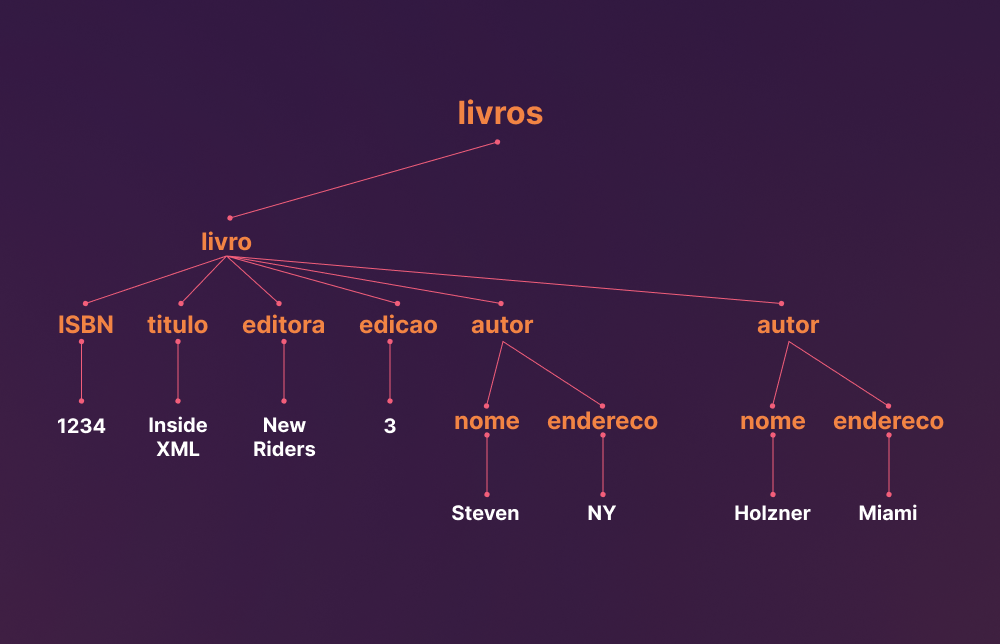

# Lista de Exercício 1 (Revisão)

## 1. O que você entende por Persistência de Dados?

Me faz alusão a persistir/salvar dados em algum lugar, sendo mais específico, me diz respeito a banco de dados, onde posso armazenar, consultar e manipular algum tipo de dado.

## 2. Quais as diferenças entre Objetos Transientes e Objetos Persistentes? Explique.

Levando em conta que objetos são constituídos por atributos e comportamentos, essas informações podem ser mapeadas em dois contextos, em tempo de execução de programa ou em bases de dados.

### Objetos Transientes

São objetos/informações que são tratadas em nível de aplicação, de modo que eles só são manipuláveis durante o tempo de execução do programa.

### Objetos Persistentes

São objetos/informações que estão acessíveis fora do tempo de execução de um programa, de forma que suas informações podem ser resgatas e manipuladas em outros momentos

## 3. Qual a principal diferença entre Banco de Dados Relacional e Banco de Dados Orientada a Objetos?

A principal diferença se encontra na estrutura de armazenamento, de forma que bancos relacionais persistem a informação de forma individualizada, onde ela vira um arquivo separado e independente dos demais, o foco fica em dados diretos.

### Relacionais

### Orientados a Objetos

Modelagem em tabelas, obedecendo Schemas já definidos. Cada tabela é composta por linhas e colunas, onde as linhas corresponde aos registros individuais, e as colunas dizem respeito aos atributos que esses registros possuem.

Modelam dados a partir de uma estrutura de objetos semelhante a de POO, cada dado é armazenado com seus atributos e métodos.

## 4. Qual o objetivo do Mapeamento Objeto Relacional (ORM)?

Seu objetivo é facilitar o mapeamento em linguagens orientadas a objetos em dados possíveis de serem persistidos dentro de um banco de dados relacional, havendo uma ponte entre dois paradigmas distintos (Paradigma Relacional e OO).

Com ele, agora é possível mapear entidades em POO diretamente para um banco de dados relacionado, de modo que temos o seguinte mapeamento:

**************Classe → Tabela**************

****Instância da Classe → Linha****

********Atributos da Classe→ Colunas********

## 5. Defina:

- ************Dados Estruturados:************ São dados que fazem alusão a dados relacionais, devem seguir um escopo de estruturação já definidos (Schema). Seguem o modelo de tabela com linhas e colunas.
    - Formato Tabular.
    - Uso de linguagem para consulta (SQL).
    - Fácil armazenamento e consulta.
    
- ************Dados Semi Estruturados:************ São dados mais flexíveis, apesar de ainda sim existir um escopo, ele é único para cada documento e possui um sistema de hierarquia muito presente.
    - Estrutura não regular, documentos são únicos e não necessariamente obedecem um escopo pré-definido
    - Representação através do conceito chave valor
    - Flexibilidade ao manipular novos campos
- **************Dados Não Estruturados:************** Aqui não existe escopo ou schemas, são dados mais complexos que podem demandar um tratamento específico, como multimídia ou qualquer outro documento que não se encaixe em tabelas ou em outras hierarquias.

## 6.Qual o nome da biblioteca responsável pela extração/captura de dados disponíveis em arquivos HTML ou XML? Explique.

Biblioteca JSoup. Provida por org.jsoup, Jsoup é uma biblioteca Java que trabalha com páginas web reais, ela provê uma API que extrai dados de uma página web em HTML, utilizando os conceitos de DOM e seletores CSS para consultar tais dados.

## 7. Os arquivos do tipo XML (eXtensible Markup Language) surgiram como forma de estruturação e troca de dados pela internet. Dentre suas principais características, preencha os seguintes questionamentos:

- Sintaxe inicial na primeira linha do arquivo.xml
    
    ```xml
    <? xml version=”1.0” encoding="UTF-8"?>
    ```
    
- Os dados são organizados em formato hierárquico ou tabular?
    
    *De maneira hierárquica*
    
- Quais são as formas de representação de um documento XML.
Justifique.
    
    Podem ser representados textualmente ou graficamente em formato de árvore.
    
    ```xml
    <livros id="01"> 
    	<livro> //elemento raiz
    		<ISBN>1234</ISBN>
    		<titulo>Inside XML</titulo>
    		<editora>New Riders</editora>
    		<edicao>3</edicao>
    		<autor>
    			<nome>Steven</nome>
    			<endereco>NY</endereco>
    		</autor>
    		<autor>
    			<nome>Holzner</nome>
    			<endereco>Miami</endereco>
    		</autor>
    	</livro>
    </livros>
    ```
    
    
    

## 8. Elabore um documento XML sobre produtos disponíveis para venda em empresas do comércio eletrônico/móveis/imóveis/roupas, a partir das seguintes condições:

▪ O produto deve possuir 5 características;
▪ Cada produto deve ter um nome de identificação;
▪ No documento deverá ter pelo menos dois produtos preenchidos.

```xml
<? xml version="1.0" encoding="UTF-8" ?>
<loja>
	<produtos>
		<produto>
				<nome>Caixa de Som</nome>
				<marca>JBL</marca>
				<modelo>Bombox</modelo>
				<preco>1900.00</preco>
				<quantidadeEstoque>7</quantidadeEstoque>
		</produto>
		<produto>
				<nome>Teclado Mecânico</nome>
				<marca>Logitech</marca>
				<modelo>TKL-915</modelo>
				<preco>849.99</preco>
				<quantidadeEstoque>3</quantidadeEstoque>
		</produto>
	</produtos>
</loja>
```

## 9. Defina o que é um documento JSON e quais suas principais características.

JSON é um abreviação para JavaScript Object Notation. Seria um conjunto de dados não ordenados de dados com uma estrutura de **chave** e **valor** englobados por um conjunto de chaves. Suas principais características são:

- **Facilidade de Uso**
    
    Utiliza de uma sintaxe simples baseada em pares, onde dados são armazenados em objetos ou arrays, além de possuir uma fácil legibilidade para desenvolvedores.
    
- ********************Estrutura Hierárquica********************
    
    Como os dados são aninhados em arrays e objetos, isso dá a linguagem uma escalabilidade para estruturas mais complexas.
    
- ******************************************Tipos de Dados Comuns******************************************
    
    JSON suporta tipos de dados comuns, como strings, números, booleanos, objetos, arrays e valores nulos.
    
- **********************Ampla Adoção**********************
    
    JSON é amplamente adotado na web e em APIs REST devido à sua simplicidade e facilidade de uso.
    

## 10. O que significa o processo de serialização e desserialização de documentos do tipo JSON?

É o processo de conversão de tipos de dados, enquanto o processo de serialização engloba transformar objetos em linguagens de programação em objetos JSON, o processo de desserialização faz o processo inverso, mapeando objetos JSON para objetos manipuláveis dentro da linguagem

## 11. Faça um exemplo de documento JSON a partir de dados sobre serviços de vendas
online.

- Utilize dados do tipo, String, Inteiro, Array e Objetos

```json
{
	"id" : "fiueh000r1gw0iufhadhe001",
	"nome" : "Cleito",
	"idade" : 25,
	"periodo" : 2023.1,
	"curso" : "Sistemas de Informação",
	"disciplinasCorrentes" : ["Web Rest", "BD com POO", "Projeto Integrador"],
	"mediasTrimestrais" : {
		"t1" : 9.2,
		"t2" : 8.5,
		"t3" : null
	},
	"aprovado" : true
}
```

## 11. Quais são as principais diferenças entre documentos do tipo JSON e XML.

Sei lá homi

## 12. Para que serve utilizar JDBC com Sistemas de Gerenciamento de Banco de Dados.

Para ser um facilitador para a persistência de dados em diversos bancos de dados utilizando a linguagem Java, com uma API simples de usar, é possível persistir dados tanto em bancos relacionais como não relacionais através de uma mesma implementação.

## 13. Cites restrições sobre a utilização do JDBC para sistemas atuais.

Não necessariamente restrições, mas empecilhos em usar JDBC puro são muito relacionados a questões de implementação. Muito tempo gasto em scripts gigantescos para para manipulação de dados, querys SQL mais e mais específicas demoram muito para serem implementadas além do JDBC dar pouco suporte a um mapeamento mais dinâmico a objetos Java dentro de banco de dados, principalmente relacionais.